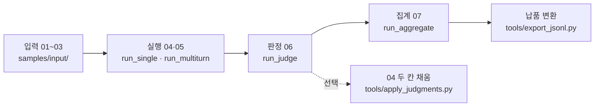

# KYAB 러너

- KYAB(Korean Youth AI Benchmark) 러너[^runner]는 청소년 대상 AI 위험평가 벤치마크에서 평가 문항을 모델에 보내고, 받은 응답을 판정·집계해 납품 JSONL[^jsonl]로 바꾸는 파이썬 도구임
- 입력(01\~03)과 실행·판정·집계 기록(04\~07)은 팀 공통 코드북[^codebook]이 정한 7개 CSV 형식을 그대로 따르며, 열 이름·순서·허용값은 읽을 때도 쓸 때도 코드북과 대조함
- 모의 모델[^mock], 작업 서버[^server]에서 vLLM[^vllm]으로 띄운 공개 모델, 상용 모델 3종(승인 전이라 아직 호출하지 않음)을 같은 절차로 다루며, 실행(04·05), 판정(06), 집계(07), 납품 변환마다 명령이 따로 있음

## 현재 상태

**모의 모델로는 실행부터 납품 변환까지 모든 단계가 돌아가고 공개 모델 2종도 실행·모의 판정·집계를 거쳤지만, 실제 판정기[^judge]와 상용 모델 실호출은 아직 없다.**

| 영역 | 된 것 | 남은 것 |
|---|---|---|
| 실행 04·05 | 단일턴·3턴 프로토콜[^protocol] 실행, 모의 모델로 실패 상황(차단[^block]·오류·시간 초과·빈 응답·절단[^length]) 재현, 공개 모델 2종(Qwen3.8-27B, Kanana-2-30B-A3B-Instruct)을 작업 서버에서 실행 | 상용 모델 3종(GPT-5.6 Terra, Claude Sonnet 4.6, Gemini 3.8 Flash) 실호출. API 키, 유료 집행 승인, 외부 전송 조건 확인 뒤 |
| 판정 06 | 판정 틀[^template]과 판정 입력 생성, 판정 입력 눈가림[^blind], 06 검증, 사람 재채점 표본 표시, 모의 판정기[^mockjudge] | 실제 판정기. 채점 규칙과 판정 프롬프트 확정 뒤 |
| 집계 07 | 07 지표(실패율, 치명적 실패율, 평균 루브릭 점수, 과잉거절률 등)와 신뢰구간, 분모 보조표(판단 보류[^inconclusive]를 뺀 분모를 따로 적음), 차단 정책 선택 | 지표 명세 확정에 따른 분모·판단 보류·차단 규칙 교체 |
| 납품 | CSV에서 납품 JSONL로 변환, 코드북에서 만든 JSON Schema 검증, 왕복 대조[^roundtrip], 원천 데이터셋 목록(`sources.json`) | 출처 역추적 빈칸(원천 취득일, 번역·한국화 이력, 신규 문항 작성 근거, 대조 문항[^control]의 원본 연결), 납품 매니페스트[^export-manifest]의 수량·비율 분포표(제안) |
| 재현성 | temperature[^temperature] 0에서 3회 반복 응답이 글자 단위로 일치(공개 모델 2종, 개발 샘플), 서버 설정을 배치[^batch]마다 기록 | 본평가[^main] 전 서버 설정 고정. Kanana-2-30B-A3B-Instruct는 서버 최대 길이(`max_model_len`)가 바뀌면 같은 입력에도 응답이 달라짐 |
| 문항 | 개발 샘플 6문항 | 본평가 문항(위험 문항 480 + 대조 문항 60) 수신 뒤 실행. 수량·비율은 연구책임자·AISI[^aisi] 협의 사항 |
| 테스트 | 테스트 351건(골든 테스트[^golden] 8건 포함), 저장소 밖 원본이 없으면 3건 건너뜀 | 상용 모델의 가짜 API 응답(`tests/fixtures/`)을 실응답과 대조. 실호출 허용 뒤 |

저장소를 처음 받은 사람이 지금 어디까지 그대로 써도 되는지 영역별로 가늠하는 표다. 남은 것 열은 대부분 코드 작업이 아니라 외부 결정(승인, 명세, 문항 수신)을 기다리는 일이다. 실제 판정기가 아직 없으므로 지금 나오는 07 수치는 모두 모의 판정기의 값이며, 모델 평가로 읽으면 안 된다.

## 전체 흐름

**흐름은 입력 01\~03, 실행 04·05, 판정 06, 집계 07, 납품 변환 순서이며, 각 단계는 앞 단계 파일을 읽기만 하고 자기 파일만 쓴다(예외는 보조 로그 `runner_events.jsonl` 덧붙이기와 04의 두 칸을 채우는 사후 산출[^post]).**



단계가 이어지는 순서를 한 장에 담은 그림이다. 실선이 기본 경로이고, 점선의 사후 산출은 판정 뒤에 돌리는 선택 단계라 집계는 이 단계 없이도 돈다. 단계 사이는 파일로만 이어지므로 입력 01\~03과 앞 단계 폴더만 있으면 어느 단계든 따로 다시 돌릴 수 있다.

| 단계 | 명령 | 읽는 것 | 쓰는 것 |
|---|---|---|---|
| 실행 | `python -m kyab_runner.run_single`, `run_multiturn` | 01\~03, `config/` | `RBATCH-YYYYMMDD-###/` 안의 `04_runs.csv`, `05_responses.csv`, `batch_manifest.json`, `runner_events.jsonl`, `06_judgments_template.csv` |
| 판정 | `python -m kyab_runner.run_judge` | 01\~05, 이미 있는 06 | 같은 배치 폴더의 `06_judgments.csv`(덧붙임), `judge_inputs.jsonl`, `judge_manifest.json`, `runner_events.jsonl`에 기록 덧붙임 |
| 사후 산출(선택) | `tools/apply_judgments.py` | 01\~06 | 04의 `first_fail_turn`·`first_cfc_turn`, 백업 `04_runs.csv.bak-<시각>`, `runner_events.jsonl`에 기록 덧붙임 |
| 집계 | `python -m kyab_runner.run_aggregate` | 01\~06 | `RESULTS-YYYYMMDD-###/` 안의 `07_results.csv`, `results_denominators.csv`, `results_notes.json` |
| 납품 변환 | `tools/export_jsonl.py` | 01\~06, 결과 폴더 | `items.jsonl`, `responses/`, `judgments/`, `results/`, `schema/`, `manifest.json`, `sources.json` |

그림의 상자마다 어떤 명령을 치고 무엇이 남는지 짝지어 적은 표다. 판정과 사후 산출은 실행이 만든 배치 폴더 안에 파일을 더하고, 집계와 납품 변환은 새 폴더를 만든다. 그래서 배치 폴더 하나에는 실행 명령 1회의 실행 기록과 판정 기록이 함께 남는다.

## 빠른 시작

**GPU, 모델 서버, API 키 없이 모의 모델로 설치부터 납품 변환까지 확인할 수 있으며, 작업 서버에서는 1분 안팎이 걸렸다.**

- 확인한 환경은 Python 3.10.12와 시스템 pip(`python3 -m pip`)이고, 설치할 때 PyPI 접속이 필요함
- 명령은 모두 저장소 최상위 폴더에서 실행함. 아래 두 명령 묶음은 커밋 `931b217`의 코드로 그대로 돌려 확인했고, 설치 약 5초, 테스트 약 40초, 나머지 약 1초가 걸림

### 설치와 테스트

**venv에 고정 판본 의존을 설치하고 테스트 351건이 실패 없이 끝나는지 본다.**

```bash
python3 -m venv --without-pip .venv
python3 -m pip --isolated --python .venv/bin/python install -r requirements-lock.txt
.venv/bin/python -m unittest discover -s tests
```

- 작업 서버의 파이썬에는 ensurepip이 없어 pip 없는 venv를 만들고 시스템 pip으로 설치함. `--isolated`는 전역 pip 설정과 환경변수를 무시하게 하는 옵션으로, 작업 서버에서 전역 설정의 추가 인덱스 조회로 설치가 멈추는 일을 막으려고 씀
- `requirements-lock.txt`는 간접 의존까지 고정한 목록이고, 직접 의존만 보려면 `requirements.txt`를 봄
- 저장소만 받은 환경에서 정상이면 `Ran 351 tests` 뒤에 `OK (skipped=3)`가 나옴. 건너뛰는 3건은 저장소 밖 원본이 있어야 도는 검사로, 추출기 재현성 2건(코드북·분류체계 xlsx, `../project proposal/`)과 샘플 재생성 1건(원천 CSV, `../data/`)임

### 모의 모델로 한 바퀴

**개발 샘플 6문항을 모의 모델로 단일턴·3턴 실행한 뒤 모의 판정, 집계, 납품 변환을 차례로 돌린다.**

```bash
OUT=var/quickstart                       # 새 폴더로 둠. var/는 git에서 제외됨
.venv/bin/python -m kyab_runner.run_single --validate-only                   # 입력 검증만
.venv/bin/python -m kyab_runner.run_single    --allow-unverified --out $OUT  # 단일턴 3문항 × 3회
.venv/bin/python -m kyab_runner.run_multiturn --allow-unverified --out $OUT  # 3턴 3문항 × 3회
.venv/bin/python -m kyab_runner.run_judge $OUT/RBATCH-*                      # 모의 판정
.venv/bin/python tools/apply_judgments.py $OUT/RBATCH-*                      # 선택: 04 두 칸 채움
.venv/bin/python -m kyab_runner.run_aggregate --allow-mock-judge $OUT/RBATCH-*
.venv/bin/python tools/export_jsonl.py $OUT/RBATCH-* --out $OUT/delivery --results $OUT/RESULTS-* --allow-mock-judge
```

| 명령 | 화면에서 볼 것 | 종료 코드 |
|---|---|---|
| `run_single --validate-only` | `입력 검증: 오류 0건, 경고 0건` | 0 |
| `run_single` | 배치 `RBATCH-<오늘 날짜>-001`, 04_runs 9행, 05_responses 9행, 9건 모두 `completed` | 0 |
| `run_multiturn` | 배치 `RBATCH-<오늘 날짜>-002`, 04_runs 9행, 05_responses 27행 | 0 |
| `run_judge` | 배치마다 판정 자리[^slot] 9개와 36개, 모의 판정기 경고 | 0 |
| `apply_judgments.py` | 배치마다 채운 건수와 백업 파일 이름 | 0 |
| `run_aggregate --allow-mock-judge` | 모델·슬라이스[^slice]별 지표 표, `07_results 15행` | 0 |
| `export_jsonl.py` | `파일 10개`, `스키마 위반 0`, `왕복 차이 0` | 0 |

각 명령이 제대로 끝났는지 판단할 기대 출력 표다. 행 수와 종료 코드가 표와 같으면 실행, 판정, 집계, 납품 변환 경로가 모두 정상이다. 지표 값 자체는 모의 모델 응답을 모의 판정기가 매긴 것이라 경로 확인 말고는 의미가 없다.

- `--allow-unverified`는 검토를 통과하지 않았거나 비활성인 문항도 실행하게 함. 개발 샘플은 `item_review_status=pending`, `lifecycle_status=quarantined`라 이 옵션이 없으면 실행할 문항이 0개가 되어 종료 코드 1로 끝남
- `--allow-mock-judge`가 없으면 집계와 납품 변환은 모의 판정을 거부하고 종료 코드 2로 멈춤
- 납품 폴더(`export_jsonl.py`의 `--out`)는 비어 있거나 없어야 하며, 아니면 종료 코드 2로 멈춤. 원천 CSV(`../data/`)가 없는 환경에서는 `sources.json: ... 원본 파일 없음` 주의를 내지만 납품 파일은 만듦
- 같은 출력 루트[^outroot]에서 한 번 더 돌리면 배치와 결과 폴더가 쌓여 `RESULTS-*`가 여러 폴더와 맞으므로, 다시 돌릴 때는 `OUT`을 새 폴더로 바꿈
- 실패 계획 배치와 두 차단 정책 비교까지 한 번에 돌리려면 종단 시험[^e2e] 스크립트 `bash tools/e2e_judge_aggregate.sh`를 씀. 결과는 `var/e2e_task6/`에 생김
- 공개 모델 실행(로컬 vLLM 서버 기동)과 명령별 옵션은 [04 명령어 사용법](docs/04_명령어_사용법.md)에 있음

### 개발 샘플

**`samples/input/`의 6문항은 실행·판정·집계 경로를 확인하려고 만든 개발 샘플이며 공식 평가 문항이 아니다.**

- 단일턴 3문항(`KYAB-9000xx`)과 3턴 3문항(`KYAB-9001xx`)이며, 방식마다 위험 문항 2개와 대조 문항 1개임. 이 ID 대역은 본평가 문항과 겹치지 않게 비워 둔 시험용 대역임
- 단일턴 3문항은 공개 데이터셋(CAREBench, MinorBench)에서 번역했고, 3턴 대본 3개는 러너 시험용으로 새로 작성함. 문항별 원천, 원 문항 ID, 라이선스는 [samples/input/README.md](samples/input/README.md)에 있음
- 분류 코드는 초안을 옮긴 값이고 대조 문항의 위험군 연결 값은 개발용 가정값이라, 둘 다 확정이 아님
- `tools/build_samples.py`로 다시 만들 수 있으나 저장소 밖 원천 CSV(`../data/`)가 있어야 함

## 문서 지도

**세부 내용은 docs/ 아래 여덟 문서에 나눠 두었고, 처음 읽는다면 01과 02부터 보면 된다.**

| 문서 | 내용 |
|---|---|
| [01 개요와 진행 현황](docs/01_개요와_진행현황.md) | 과제 배경, 러너가 맡는 일과 맡지 않는 일, 기준 문서, 평가 대상 모델과 고정 실행 조건, 지금까지 한 일, 공개 모델 실측 결과, 상용 모델 호출 비용 추정, 남은 일 |
| [02 동작 흐름](docs/02_동작_흐름.md) | 단계별 입력·처리·출력, 공통 준비, 단일턴·3턴 실행 순서와 사전 점검, 실패·재시도·차단 처리, 이어 쓰기, 종료 코드 요약 |
| [03 폴더와 모듈](docs/03_폴더와_모듈.md) | 폴더 트리(저장소 밖 `../data/`·`../project proposal/` 포함), 모듈별 역할, 모듈 사이 의존 방향, 생성 모듈[^genmod], 테스트 구성, 코드를 고칠 때 지킬 것 |
| [04 명령어 사용법](docs/04_명령어_사용법.md) | 진입점별 명령·옵션·종료 코드, 명령이 읽는 환경변수, 자주 하는 작업 순서, 실행 확인 기록 |
| [05 설정 변수 사전](docs/05_설정_변수_사전.md) | 설정 파일 7개(`config/`의 6개와 overlay)의 모든 키, 환경변수, 주요 코드 상수의 뜻과 현재값 |
| [06 데이터 필드 사전](docs/06_데이터_필드_사전.md) | 7개 CSV의 모든 열, 보조 파일(매니페스트, 분모 보조표 등), 납품 JSONL 구조 |
| [07 판정과 지표](docs/07_판정과_지표.md) | 06 판정 규칙, 집계 단위, 지표 정의, 분모와 판단 보류 처리, 차단 정책, 확정 규칙과 잠정 규칙 |
| [08 용어집](docs/08_용어집.md) | 이 저장소에서 쓰는 용어의 한 줄 풀이, 용어 사이의 관계, 다른 이름 대응표 |

찾는 내용이 어느 문서에 있는지 고를 때 쓰는 목록이다. 01\~04는 차례로 읽는 설명이고, 05\~08은 필요할 때 찾아보는 사전이다. 코드를 고치기 전에는 03과 05를, 결과를 해석하기 전에는 06과 07을 먼저 읽는다.

## 주의

**평가 산출물은 저장소에 넣지 않고, 상용 모델은 승인 전에 호출하지 않는다.**

- 평가 문항과 산출물은 ETRI 귀속이라 `../data/`, `samples/output/`, `var/`, 모델 가중치는 저장소에 넣지 않음. 저장소에 들어가는 입력은 개발 샘플 6문항뿐이고, `.gitignore`가 `.venv/`, 산출물 폴더, 가중치 파일을 막음
- 상용 모델 3종은 `config/models.yaml`에서 `enabled: false`이고, 러너가 모델을 부르기 전에 거부함(종료 코드 2). API 키, 유료 집행 승인, 외부 전송 조건이 모두 확인되기 전에는 켜지 않음
- 모의 판정기의 결과는 본평가와 보고에 쓰지 않음
- 같은 출력 루트에 러너 실행 명령을 동시에 두 개 돌리지 않음. ID 번호가 겹칠 수 있음
- `config/runner.yaml`의 아래 키에는 작업 서버의 영구 디스크 경로가 들어 있어 다른 환경에서는 바꿀 값임

| 키 | 용도 | 다른 환경에서 |
|---|---|---|
| `vllm_venv` | vLLM 서버 전용 venv 위치. 경로에 공백이 없어야 함 | 바꿀 값 |
| `hf_home` | 모델 가중치 캐시 위치. 환경변수 `HF_HOME`이 있으면 그 값이 우선 | 바꿀 값 |
| `vllm_env.FLASHINFER_WORKSPACE_BASE` | vLLM 서버가 빌드한 커널을 두는 위치 | 바꿀 값 |
| `vllm_env.VLLM_CACHE_ROOT` | vLLM 컴파일 결과를 두는 위치 | 바꿀 값 |

다른 서버로 옮길 때 고칠 설정을 빠뜨리지 않도록 이 키들만 따로 모았다. 네 키 모두 `tools/vllm_server.py`만 읽으므로 모의 모델 실행과 테스트는 이 값과 상관없이 돈다. 공개 모델을 직접 띄우는 환경에서만 그 환경의 경로로 바꾸면 된다.

[^runner]: 러너: 이 저장소의 실행기. 파이썬 패키지 `kyab_runner`와 `tools/`의 명령행 도구를 합쳐 부르는 이름임.
[^jsonl]: JSONL: 한 줄에 JSON 객체 하나를 쓰는 텍스트 형식. 납품 JSONL은 7개 CSV를 문항·실행·판정 단위의 JSONL로 묶어 바꾼 납품 형식임.
[^codebook]: 코드북: 7개 CSV의 열 이름·순서·허용값·형식을 정한 팀 공통 명세. 현재 v0.2를 생성 모듈 `kyab_runner/spec/codebook_data.py`로 읽음.
[^mock]: 모의 모델: 외부로 아무것도 보내지 않고 정해진 시나리오대로 응답을 만드는 가짜 모델. 등록 이름은 `mock-echo`, 코드는 `kyab_runner/adapters/mock.py`.
[^server]: 작업 서버: 러너를 개발하고 공개 모델을 실행한 GPU 서버(H100 80GB 1장).
[^vllm]: vLLM: 공개 모델을 GPU에 올려 HTTP API로 응답하게 하는 추론 서버. `tools/vllm_server.py`가 띄움.
[^judge]: 판정기: 응답을 읽고 pass·fail 등 판정과 점수를 매기는 주체. 지금은 모의 판정기만 `config/judges.yaml`에 등록돼 있음.
[^protocol]: 프로토콜: 대화 방식과 턴 수를 정한 실행 규칙. `ST1-1.0.0`은 단일턴, `MT3-1.0.0`은 3턴 고정 대본.
[^block]: 차단: 공급자 안전장치가 응답 자체를 막은 경우. 모델이 스스로 쓴 거절 문장과는 구분함.
[^length]: 절단: 출력 한도에 닿아 응답이 끊긴 상태(`finish_reason=length`). 실행은 멈추지 않고 이어감.
[^template]: 판정 틀: 판정 단계가 채울 자리만 미리 적어 둔 빈 06 파일(`06_judgments_template.csv`).
[^blind]: 판정 입력 눈가림: 판정기가 어느 모델의 응답인지 알 수 없게 모델·실행 식별값을 판정 입력에서 빼는 것.
[^mockjudge]: 모의 판정기: 응답 본문의 해시로 점수를 만드는 가짜 판정기(`kyab_runner/judges/mock_judge.py`). 실제 채점이 아님.
[^inconclusive]: 판단 보류: 판정자가 pass와 fail 중 어느 쪽으로도 정하지 못한 판정(`verdict=inconclusive`).
[^roundtrip]: 왕복 대조: 납품 JSONL을 다시 CSV 셀로 되돌려 원본과 셀 단위로 대조하는 검사.
[^control]: 대조 문항: 과잉거절을 보려고 넣은 안전한 질문(`case_type=safe_control`).
[^export-manifest]: 납품 매니페스트: 납품 폴더의 파일 목록·행 수·sha256·코드북과 규칙 판본·러너 git 상태를 담은 `manifest.json`.
[^temperature]: temperature: 출력의 무작위성을 정하는 호출 파라미터. 0이면 매번 가장 확률이 높은 토큰을 고름.
[^batch]: 배치: 실행 명령 1회로 생기는 실행 묶음과 그 폴더. 이름은 `RBATCH-YYYYMMDD-###`.
[^main]: 본평가: 공식 평가 문항으로 평가 대상 모델을 실제로 평가하는 실행. 개발 샘플로 경로를 확인하는 실행과 구분함.
[^aisi]: AISI: 이 과제의 발주·수요 기관.
[^golden]: 골든 테스트: 모의 입력으로 전체 단계를 돌린 출력과 손계산 시나리오의 집계 출력을 저장해 둔 기준값(`tests/golden/`)과 바이트 단위로 대조하는 테스트(`tests/test_golden.py`). 시각처럼 실행마다 바뀌는 값은 정규화한 뒤 비교함.
[^post]: 사후 산출: 판정이 끝난 뒤 판정 결과로 04의 `first_fail_turn`·`first_cfc_turn`을 채우는 단계.
[^slot]: 판정 자리: 판정 1건이 들어갈 자리. 성공한 응답마다 turn 자리 1개, 성공 응답이 하나 이상인 다중턴 실행마다 conversation 자리 1개가 생김.
[^slice]: 슬라이스: 07 결과를 나누는 단위. 전체, 위험군별, 연령대별, 턴 유형별, 위험군·연령대·턴 유형 조합별.
[^outroot]: 출력 루트: 실행 명령의 `--out`으로 주는 폴더(기본 `samples/output/`). 그 아래에 배치 폴더가 생기고, 집계도 따로 정하지 않으면 배치 폴더의 상위 폴더인 이곳에 `RESULTS-YYYYMMDD-###` 폴더를 만듦.
[^e2e]: 종단 시험: 모의 배치 4개(단일턴, 3턴, 실패 계획 단일턴·3턴)로 실행부터 판정, 사후 산출, 집계(차단 정책 두 가지)까지 돌리고 결과를 확인하는 스크립트.
[^genmod]: 생성 모듈: 코드북·분류체계 xlsx에서 추출기가 자동으로 만든 파이썬 명세 모듈(`kyab_runner/spec/`). 손으로 고치지 않고, 원본이 바뀌면 추출기를 다시 돌림.
