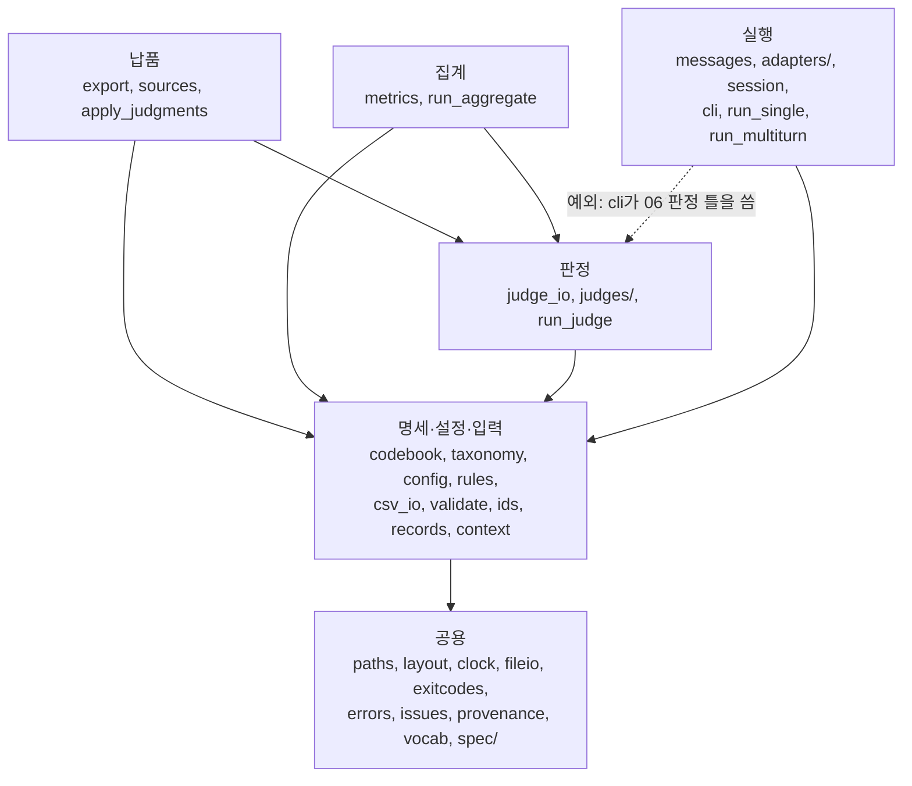

# 폴더와 모듈

러너 저장소의 폴더 구성, 모듈마다 맡은 일, 모듈 사이 의존 방향, 생성 모듈[^generated], 테스트 구성, 코드를 고칠 때 지킬 것을 정리한다. 기준은 2026-10-08 커밋 `931b217`의 코드다. 각 단계가 무엇을 읽고 쓰는지는 [동작 흐름](02_동작_흐름.md), 명령과 옵션은 [명령어 사용법](04_명령어_사용법.md), 설정 키는 [설정 변수 사전](05_설정_변수_사전.md)에 있다.

목차

1. [폴더 트리](#1-폴더-트리)
2. [모듈별 역할](#2-모듈별-역할)
3. [계층과 의존 방향](#3-계층과-의존-방향)
4. [생성 모듈](#4-생성-모듈)
5. [테스트 구성](#5-테스트-구성)
6. [코드를 고칠 때](#6-코드를-고칠-때)

## 1. 폴더 트리

**저장소에는 코드, 명령행 도구, 설정, 코드북[^codebook] overlay[^overlay], 개발 샘플, 테스트, 설명 문서만 들어 있고, 실행 산출물과 원본 자료는 저장소 밖에 둔다.**

```
runner/                          저장소 최상위
  README.md                      저장소 안내(현재 상태, 빠른 시작, 문서 지도)
  docs/                          설명 문서 01~08(이 문서 묶음)
  requirements.txt               러너 venv 직접 의존 5개(openpyxl, PyYAML, anthropic, jsonschema, httpx2)
  requirements-lock.txt          러너 venv 전체 고정본(간접 의존 포함)
  requirements-vllm.txt          로컬 vLLM 서버 전용 venv의 의존(러너 venv와 별개)
  .gitignore                     저장소에서 뺄 것(.venv/, .venv-vllm/, 파이썬 캐시, samples/output/, var/, 모델 가중치 파일)
  config/
    runner.yaml                  실행 규칙 기본값(호출 파라미터, 프로토콜, 재시도, 시간대, vLLM 서버 경로)
    models.yaml                  모델 등록부(어댑터 이름, 모델 판본, 사용 여부, 어댑터 옵션)
    aggregation_rules.yaml       판정·집계 규칙(코드북이 정하지 않은 결정)
    judges.yaml                  판정기 등록부, 판정 입력 눈가림 점검 패턴
    sources.yaml                 원천 등록부(HF 저장소·커밋·원본 sha256)
    system_prompt.txt            모든 실행에 보내는 시스템 프롬프트 원문
  schema/
    overlay_v0.3_confirmed.yaml  코드북 v0.2 위에 덮어쓰는 변경 17항목(confirmed 9, provisional 8)
  kyab_runner/                   러너 패키지. 층별 모듈은 2장, 생성 모듈이 든 spec/은 4장
  tools/                         명령행 도구 9개와 추출기 공용 모듈(2.4)
  samples/
    input/                       개발 샘플 입력 01~03 CSV와 README.md(실제 평가 문항 아님)
    mock_plan_failures.yaml      실패 경로 모의 계획(--mock-plan에 넘김)
  tests/
    support.py                   테스트 공용 기반(5.3)
    test_*.py                    테스트 파일 12개(5.2)
    fixtures/                    상용 API 가짜 응답 23개(openai 8, anthropic 8, gemini 7)
    golden/chain_sha256.json     골든 테스트 기준값. 전체 사슬 출력 53개 파일의 sha256(5.4)
    golden/metrics/              골든 테스트 기준값. 지표 기준 파일 14개 + metrics_sha256.json

실행하면 생기는 폴더(.gitignore로 저장소에서 뺌)
  .venv/                         러너 venv
  samples/output/                실행기 기본 출력 루트. 배치 폴더(RBATCH-…)와, 집계가 기본으로 배치 폴더 옆에 만드는 결과 폴더(RESULTS-…)가 쌓임
  var/                           vllm_server.json·vllm_server.log, 종단 시험 출력(e2e_task6/)

저장소 밖(runner/ 옆 폴더, 공유 대상 아님)
  ../project proposal/           코드북·분류체계 원본 xlsx(추출기의 기본 위치)
  ../data/                       원천 CSV(build_samples.py, 납품 sources.json의 sha256 대조)
```

저장소를 처음 받은 사람이 파일 위치를 찾을 때 쓰는 트리다. 패키지와 도구 안의 파일은 2장 표에 있고, 마지막 두 묶음은 저장소에 들어 있지 않은 폴더다. 저장소만 받은 환경에는 원본 xlsx와 원천 CSV[^source]가 없으므로 추출기와 샘플 생성 도구에는 경로를 따로 줘야 하고, 이 둘에 기대는 테스트 3개는 건너뛴다(5.1).

- `config/runner.yaml`의 `vllm_venv`, `hf_home`, `vllm_env.FLASHINFER_WORKSPACE_BASE`, `vllm_env.VLLM_CACHE_ROOT`에는 작업 서버[^server]의 절대 경로가 들어 있어 다른 환경에서는 바꿀 값임(키의 뜻은 [설정 변수 사전](05_설정_변수_사전.md)). `hf_home`은 환경변수 `HF_HOME`이 있으면 그 값이 우선함(`tools/vllm_server.py`의 `hf_home`)
- 원본 xlsx와 원천 CSV의 위치는 각각 `tools/_xlsx_common.py`의 `DEFAULT_SRC_DIR`, `kyab_runner/paths.py`의 `DEFAULT_DATA_DIR`가 정하며, 둘 다 저장소 최상위 폴더(트리의 `runner/`)의 상위 폴더 기준 상대 위치임

## 2. 모듈별 역할

**`kyab_runner/`의 모듈은 아래층부터 공용, 명세·설정·입력, 실행, 판정, 집계, 납품 여섯 층으로 나뉘고, 여기에 패키지 밖 명령행 도구(`tools/`)가 더해진다.**

- 층의 이름과 소속은 `kyab_runner/__init__.py`의 층 지도와 `tests/test_layering.py`의 `LAYERS`를 그대로 따름. 진입점[^entry]은 따로 층을 이루지 않고 자기 단계의 층에 속함(예: `run_judge`는 판정 층)
- "직접 import하는 곳"은 2026-10-08 커밋 `931b217`의 소스를 파이썬 `ast`로 읽어 그 모듈을 import하는 패키지 모듈과 `tools/` 스크립트를 모두 뽑은 것임. 3장의 층 그림은 이 열의 import로 그린 것임

### 2.1 공용 층

**공용 층은 경로, 파일 이름, 시각, 파일 쓰기, 종료 코드, 오류, 검증 결과, 코드 출처, 통제어휘[^vocab], 생성 모듈을 한 곳에서 정하며, 다른 층의 모듈을 import하지 않는다.**

| 모듈 | 한 줄 역할 | 직접 import하는 곳 |
|---|---|---|
| `__init__.py` | 패키지 판본(`__version__ = "0.1.0"`)과 층 지도(모듈 구성 설명) | provenance(실행 코드 판본 문자열) |
| `paths.py` | 저장소 최상위 폴더, 설정 파일, 기본 입력·출력 폴더, `var/` 위치 상수 | provenance, codebook, config, rules, context, adapters/local_vllm, cli, run_judge, run_aggregate, sources, export, apply_judgments, tools(build_samples, e2e_check, vllm_server) |
| `layout.py` | 입력·배치[^batch]·결과·납품 폴더 안의 파일 이름 상수 | ids, records, judge_io, run_judge, run_aggregate, export, tools(build_samples, check_determinism, e2e_check) |
| `clock.py` | 설정 시간대(`runner.yaml`의 `timezone`) 기준 현재 시각과 세 가지 표기(ISO 8601 밀리초, `YYYYMMDD`, `YYYYMMDDTHHMMSS`) | records(기록 시각), cli(배치 날짜), run_aggregate, apply_judgments(백업 이름), tools/vllm_server.py |
| `fileio.py` | JSON 원자적 쓰기[^atomic], JSONL[^jsonl] 쓰기·읽기, 파일 sha256 | records, adapters/local_vllm, cli, judge_io, run_judge, run_aggregate, sources, export, tools(e2e_check, vllm_server) |
| `exitcodes.py` | 종료 코드 상수(0 정상, 1 할 일 없음, 2 입력·설정·검증 오류, 130 사람이 중단)와, 도구별로 뜻이 다른 1의 목록(설명 문자열) | cli, run_judge, run_aggregate, export, apply_judgments, tools/build_samples.py |
| `errors.py` | 명세·설정 오류의 공통 부모 `SetupError`와 yaml 로더 `load_yaml` | vocab, codebook, taxonomy, config, rules, context, sources |
| `issues.py` | 검증 결과 1건(`Issue`)과 모으기·필드 검사·중복 검사·출력 도우미 | validate, cli, judge_io, metrics |
| `provenance.py` | 러너 git 상태(`git_state`)와 `execution_library_version` 문자열(`library_version`) | cli(04, `batch_manifest.json`), export(납품 매니페스트) |
| `vocab.py` | 코드가 비교·기록에 쓰는 코드북 허용값 상수와 로드 때 대조(`check_vocabulary`) | 패키지 모듈 18개(records, validate, context, 어댑터[^adapter] 5개(base, mock, local_vllm, commercial, anthropic), session, cli, run_multiturn, judge_io, judges/mock_judge, run_judge, metrics, sources, export, apply_judgments)와 tools/build_samples.py |
| `spec/` | 생성 모듈 묶음(4장). `codebook_data.py`는 코드북 v0.2 xlsx를 옮긴 dict(`CODEBOOK`)와 원본 파일 이름·sha256, `taxonomy_data.py`는 분류체계 A1\~A10(상위 10, 하위 39)과 이전 코드(R·M) 대응표 49행(`TAXONOMY`, `CROSSWALK`) | codebook·export(코드북 출처)가 `codebook_data`를, taxonomy가 `taxonomy_data`를 씀 |

경로·파일 이름·시각 같은 값을 어느 모듈이 정하는지 찾을 때 이 표를 본다. 파일 이름은 `layout.py`, 기록 시각 형식은 `clock.py`처럼 값마다 고칠 모듈이 하나로 정해져 있다. 각 모듈 설명에도 "다른 모듈은 파일 이름을 직접 적지 않고 여기서 가져온다"는 식의 약속이 적혀 있어, 같은 값이 여러 곳에 흩어지지 않는다.

### 2.2 명세·설정·입력 층

**명세·설정·입력 층은 코드북·분류체계·설정·규칙을 읽어 검사하고, 그 명세에 맞춰 CSV를 읽고 쓰며, 입력과 끝난 배치를 조회한다.**

| 모듈 | 한 줄 역할 | 직접 import하는 곳 |
|---|---|---|
| `codebook.py` | 생성 모듈에 overlay를 덮어써 `Codebook`(필드 명세 `FieldSpec` 목록)을 만들고 값·행을 검사 | validate, context, cli, metrics, export, tools(build_samples, check_determinism) |
| `taxonomy.py` | 생성 모듈에서 위험군·소분류·상위 관계·이전 코드를 담은 `Taxonomy`를 만듦 | context, cli, tools(build_samples, check_determinism) |
| `config.py` | `runner.yaml`·`models.yaml`·시스템 프롬프트를 읽고 키·값 종류·금지 옵션을 검사(`RunnerConfig`, `ModelEntry`). 구현된 `context_text` 위치 상수 `CONTEXT_POSITIONS`도 둠 | rules(등록부 항목 검사 `build_entry`), context, messages(`CONTEXT_POSITIONS`), cli, tools(build_samples, vllm_server) |
| `rules.py` | `aggregation_rules.yaml`·`judges.yaml`을 읽고 코드북과 대조(`Rules`, `JudgeEntry`). 규칙 키워드 상수 `TAG_REVISION_CURRENT` | context, judge_io(`TAG_REVISION_CURRENT`) |
| `csv_io.py` | 코드북 열 순서 그대로 CSV 읽기·검사·덧붙이기·다시 쓰기(UTF-8 BOM, RFC 4180, 줄바꿈 `\r\n`) | ids, records, context, session, cli, judge_io, run_judge, metrics, run_aggregate, export, apply_judgments, tools(build_samples, check_determinism, e2e_check) |
| `validate.py` | 입력 3종(01·02·03) 검증(필드, 키·연결, 문항 규칙, 태그 규칙)과 문항 판본 키 `item_key`·표기 `item_label` | records, context, cli, judge_io, run_judge, metrics, run_aggregate, export, apply_judgments, tools(build_samples, e2e_check) |
| `ids.py` | `RBATCH`·`RUN`·`RESP`·`JDG`·`RESULT` 번호 발급, 배치 폴더·결과 폴더 찾기 | cli, judge_io, run_judge, run_aggregate, tools/e2e_check.py |
| `records.py` | 입력 3종 읽기·색인(`InputIndex`), 배치 폴더 조회(`BatchFolder`, `BatchRecords`, `BatchView`), 배치 기록 오류 `RecordsError`(깨진 `batch_manifest.json` 포함), 러너가 채우는 생성 단계·호출 파라미터 상수 | context, session, cli, judge_io, metrics, export, apply_judgments |
| `context.py` | 판정·집계·납품 공통 준비(`load_environment`, `open_views`, `prepare`)와 설정 오류 묶음 `SETUP_ERRORS`. `prepare`는 명세·설정·규칙·입력 3종·배치 폴더를 읽어 `Prepared`(`env`, `index`, `views`)를 돌려줌 | cli, run_judge, run_aggregate, export, apply_judgments, tools(build_samples, check_determinism, e2e_check, vllm_server) |

명세가 바뀌었을 때 영향을 받는 모듈은 이 표의 오른쪽 열을 따라가며 가늠한다. `rules.py`를 직접 쓰는 곳은 `context.py`와 규칙 키워드 상수 하나를 가져가는 `judge_io.py`뿐이고, 판정·집계·납품 진입점과 `tools/e2e_check.py`는 모두 `context.prepare`를 거쳐 명세·설정·규칙·입력·배치를 한 번에 받는다. 그래서 규칙 파일 로드 방식이나 준비 순서가 바뀌어도 고칠 곳은 `rules.py`와 `context.py`로 좁혀진다.

### 2.3 실행·판정·집계·납품 층

**실행·판정·집계·납품 네 층은 단계별 처리와 그 단계의 진입점을 담고, 판정·집계·납품 층은 실행 층을 import하지 않는다.**

| 층 | 모듈 | 한 줄 역할 | 직접 import하는 곳·실행 방법 |
|---|---|---|---|
| 실행 | `messages.py` | 03 행으로 요청 메시지 배열(system, 앞 턴 이력, user)을 만들고 `context_text`를 user 앞에 붙임 | run_single, run_multiturn |
| 실행 | `adapters/__init__.py` | `models.yaml`의 adapter 이름으로 어댑터를 만듦(`create_adapter`). 어댑터 모듈은 지연 import[^lazy] | cli |
| 실행 | `adapters/base.py` | 어댑터 규격(`Adapter`, `CallInfo`, `AdapterResult`), 결과 도우미, 재시도 대상 HTTP 상태 표 | 모든 어댑터, adapters/__init__(함수 안), session, cli |
| 실행 | `adapters/mock.py` | 모의 모델[^mock]. 시나리오 8종(normal, refusal, length, blocked, empty, error, timeout, flaky) | adapters/__init__(함수 안). 모델 등록부의 `mock-echo` |
| 실행 | `adapters/local_vllm.py` | 작업 서버에서 띄운 vLLM[^vllm] 서버(localhost)만 호출하고, 서버가 올린 스냅샷이 등록 판본과 같은지 확인 | adapters/__init__(함수 안). 모델 등록부의 공개 모델 |
| 실행 | `adapters/http_json.py` | 표준 라이브러리(urllib)로 JSON POST. 4xx·5xx도 예외 대신 응답 객체(`HttpReply`)로 돌려줌 | commercial, openai |
| 실행 | `adapters/commercial.py` | 상용 어댑터 공통부(API 키 환경변수, 보내지 않을 파라미터, HTTP 오류 분류, 공통 틀) | openai, anthropic, gemini |
| 실행 | `adapters/openai.py`, `anthropic.py`, `gemini.py` | 상용 어댑터. 차례로 OpenAI Chat Completions, Anthropic Messages API(공식 SDK 사용), Gemini generateContent | adapters/__init__(함수 안). 모델 등록부에서 셋 다 `enabled: false` |
| 실행 | `session.py` | 실행 1건의 턴 호출·재시도와 05·04 행 기록(`Batch`, `RunSession`) | cli |
| 실행 | `cli.py` | 두 실행기의 공통부. 명세·설정 로드, 입력 읽기·검증, 문항 선정, 사전 점검, 배치 폴더 열기와 배치 매니페스트 잠금[^lock], 반복·이어 쓰기, 판정 틀, 요약 | run_single, run_multiturn(직접 실행하지 않음) |
| 실행 | `run_single.py` | 단일턴 실행기(기본 프로토콜 `ST1-1.0.0`). 고유 함수는 대화 1건을 진행하는 `conduct_single` 하나이고 `main`은 `cli.main`을 부르기만 함 | `python -m kyab_runner.run_single` |
| 실행 | `run_multiturn.py` | 다중턴 실행기(기본 `MT3-1.0.0`). 고유 함수는 대본 발화를 차례로 보내며 실제 응답을 이력에 쌓는 `conduct_multiturn` 하나 | `python -m kyab_runner.run_multiturn` |
| 판정 | `judge_io.py` | 판정 틀, 판정 입력(`judge_inputs.jsonl`), 사람 재채점 표본, 06 검증, 주 판정 집합[^primary], `first_fail_turn`·`first_cfc_turn` 계산 | cli(판정 틀), run_judge, metrics, run_aggregate, export, apply_judgments, tools/e2e_check.py |
| 판정 | `judges/__init__.py` | `judges.yaml`의 adapter 이름으로 판정기를 만듦(`create_judge`, 지금은 `mock_judge`만) | run_judge |
| 판정 | `judges/base.py` | 판정기 규격(`Judge`, `JudgeResult`) | judges/mock_judge |
| 판정 | `judges/mock_judge.py` | 모의 판정기[^mockjudge]. 같은 응답 본문이면 같은 점수(결정적) | judges/__init__. 판정기 등록부의 `mock-judge` |
| 판정 | `run_judge.py` | 판정 실행기. 판정 입력 → 판정기 → 06 검증 → `06_judgments.csv` 덧붙이기 | `python -m kyab_runner.run_judge <배치 폴더…>` |
| 집계 | `metrics.py` | 지표 산식, 실행 단위 정리(`RunCase`), 슬라이스[^slice] 집계, 분모 보조표, 07 검증 | run_aggregate, tools/e2e_check.py |
| 집계 | `run_aggregate.py` | 집계 실행기. 06 검증 → 모의 판정 거부 → 지표 → 07 검증 → 결과 폴더 | `python -m kyab_runner.run_aggregate <배치 폴더…>` |
| 납품 | `export.py` | 7 CSV를 납품 JSONL로 변환, JSON Schema 생성, 비밀값 검사, 왕복 대조[^roundtrip]. `main()` 포함 | tools/export_jsonl.py, `python -m kyab_runner.export` |
| 납품 | `sources.py` | 원천 등록부(`config/sources.yaml`) 로드와 납품 `sources.json` 뼈대 | export, tools/build_samples.py |
| 납품 | `apply_judgments.py` | 사후 산출[^post]. 주 판정 집합으로 04의 두 칸을 채우고 원본은 백업. `main()` 포함 | tools/apply_judgments.py, `python -m kyab_runner.apply_judgments` |

단계별로 열어 볼 모듈과 명령 하나가 시작되는 모듈을 고르는 표다. 판정 입출력(`judge_io`)은 판정 층 밖의 집계·납품 층과 실행기 공통부도 쓰고, 단일턴·다중턴 실행기는 대화 진행 함수와 기본 프로토콜만 다를 뿐 나머지는 모두 `cli.main`이 맡는다. 06을 읽고 검증하는 규칙이 `judge_io` 한 곳에 모여 있으므로 판정·사후 산출·집계·납품은 같은 기준으로 06을 검증하고, 사후 산출과 집계는 같은 함수(`select_primary`)로 주 판정 집합을 고른다.

- 실행 명령은 저장소 최상위 폴더에서 venv 파이썬(`.venv/bin/python`)으로 돌리며, 옵션과 종료 코드는 [명령어 사용법](04_명령어_사용법.md)에 있음. `export.py`와 `apply_judgments.py`는 라이브러리 함수와 `main()`을 함께 담고, 명령행은 `tools/`의 얇은 껍데기가 맡음. `python -m kyab_runner.…`으로 실행해도 같은 `main`이 돎(`tests/test_tools.py`의 `ApplyJudgmentsEntryTest`가 사후 산출의 두 방법을 확인)
- 실행 절차를 고칠 때는 대부분 `cli.py`나 `session.py`를 열고, 두 실행기 파일은 대화 방식이 바뀔 때만 손댐
- 어댑터 생성(`create_adapter`)은 `cli`가 부르고 `session`은 어댑터 규격(`CallInfo`)만 import함. 판정기(`judges/`)와 판정 입출력(`judge_io`)도 서로 import하지 않고 `run_judge`가 둘을 이음

### 2.4 명령행 도구

**`tools/`의 스크립트는 패키지 밖에서 도는 명령행 도구이며, 파이썬 도구 가운데 명세 추출기 묶음(추출기 두 개와 공용 모듈)만 `kyab_runner`를 import하지 않는다.**

| 파일 | 한 줄 역할 | 쓰는 kyab_runner 모듈 |
|---|---|---|
| `extract_codebook.py` | 코드북 xlsx → `kyab_runner/spec/codebook_data.py` | 없음(openpyxl, `_xlsx_common`) |
| `extract_taxonomy.py` | 분류체계 xlsx → `kyab_runner/spec/taxonomy_data.py`. 시트 사이 교차 검산 | 없음(openpyxl, `_xlsx_common`) |
| `_xlsx_common.py` | 두 추출기 공용. 원본 xlsx 찾기, sha256, 생성 모듈 본문 만들기·쓰기, 종료 코드 값(입력·형식 오류 2, 선언·검산 불일치 1) | 없음 |
| `build_samples.py` | 개발 샘플 6문항을 `samples/input/`에 생성. 원천 CSV 필요, 입력 검증을 경고 없이 통과해야 기록 | codebook, config, context, csv_io, exitcodes, layout, paths, sources, taxonomy, validate, vocab |
| `vllm_server.py` | 로컬 vLLM 서버 `start`·`status`·`stop`. 기동 정보를 `var/vllm_server.json`에 기록 | clock, config, context, fileio, paths |
| `check_determinism.py` | 같은 (문항, 턴)의 반복 응답이 같은지 비교 | codebook, context, csv_io, layout, taxonomy |
| `apply_judgments.py` | `kyab_runner.apply_judgments.main`의 얇은 껍데기 | apply_judgments |
| `export_jsonl.py` | `kyab_runner.export.main`의 얇은 껍데기 | export |
| `e2e_judge_aggregate.sh` | 종단 시험. 모의 배치 4개 → 판정 → 06 검증 → 사후 산출 → 집계(모의 판정 거부 확인 뒤 허용) → 차단 정책 비교 → 결과 확인. 출력은 `var/e2e_task6/` | (python 모듈을 명령으로 부름) |
| `e2e_check.py` | 종단 시험 결과 확인(06, 07, 분모 보조표). 준비는 `context.prepare` | context, csv_io, fileio, ids, judge_io, layout, metrics, paths, validate |

패키지 밖 스크립트가 패키지의 어느 부분에 기대는지 정리했다. 추출기 묶음은 `kyab_runner`를 전혀 부르지 않고 종료 코드 값만 `kyab_runner/exitcodes.py`의 약속에 맞춰 따로 두며, 껍데기 두 개와 셸 스크립트를 뺀 나머지 파이썬 도구는 `context`(설정 오류 묶음이나 `prepare`)와 공용 층을 함께 쓴다. 추출기가 패키지를 import하지 않으므로, 새 판 코드북이 지금 코드의 로드 검사(예: 통제어휘 대조)를 통과하지 못하는 상태에서도 생성 모듈을 먼저 다시 만들 수 있다.

## 3. 계층과 의존 방향

**import는 각 모듈에서 같은 층이나 아래층으로만 향하고, 이 방향을 거스르는 곳은 실행기 공통부 `cli`가 판정 틀을 쓰려고 `judge_io`를 import하는 한 곳뿐이다.**

### 3.1 층 그림

**여섯 층은 아래에서 위로 공용, 명세·설정·입력, 실행, 판정, 집계, 납품 순서로 쌓이고, 판정·집계·납품 층은 실행 층을 거치지 않는다.**



모듈을 고치거나 새로 둘 때 어느 층에 넣을지 정하는 기준으로 쓰는 그림이다. 화살표는 import 방향이고, 아래층(실행)에서 위층(판정)으로 향하는 점선 하나가 `kyab_runner/__init__.py`와 `tests/test_layering.py`에 이유와 함께 적힌 유일한 예외다. 판정·집계·납품 층에서 실행 층으로 가는 화살표가 없으므로, 실행 쪽(어댑터, 대화 진행, 기록 절차)을 고친 영향은 import를 타고 판정 이후 단계로 번지지 않는다.

- 네 단계 층(실행·판정·집계·납품)은 모두 공용 층도 직접 import하지만 그림에서는 그 화살표를 생략함. 같은 층 안의 import(예: `cli → session`, `export → sources`)는 방향을 따지지 않고, 패키지 밖인 `tools/`는 층 검사 대상이 아님(도구마다 쓰는 모듈은 2.4 표)
- 단계 사이는 06을 다루는 판정 입출력(`judge_io`)과 배치 조회(`records`)로 이어짐. 집계(`metrics`, `run_aggregate`), 납품(`export`, `apply_judgments`), 실행기 공통부(`cli`)가 모두 `judge_io`를 거치므로, 06 검증 규칙을 바꾸면 판정·사후 산출·집계·납품이, 주 판정 집합 규칙을 바꾸면 사후 산출과 집계가 함께 바뀜. 이런 변경은 골든 테스트[^golden]로 확인함(5.4)
- 어댑터 모듈은 `create_adapter` 안에서 지연 import함. `import kyab_runner.metrics`를 하면 `kyab_runner` 패키지 자신을 빼고 18개 모듈(하위 패키지 `spec` 포함)만 올라오고 `adapters`·`session`은 올라오지 않음(2026-10-08, `sys.modules`로 확인)

### 3.2 층 규칙과 예외

**`tests/test_layering.py`는 층 규칙, 예외의 문서화, 사설 이름 사용을 검사하고, 옛 위치에 남겨 둔 재수출 이름은 이 검사 밖에 있다.**

| 구분 | 내용 | 확인하는 곳 |
|---|---|---|
| 규칙 | 각 모듈은 자기 층이나 아래층만 import함. 층 지도(`LAYERS`)에 없는 모듈이 import에 나오면 테스트가 실패함 | `test_modules_import_only_same_or_lower_layers` |
| 예외 | `cli`(실행)가 `judge_io`(판정)의 `write_template`을 불러 실행 끝에 06 판정 틀을 씀. 판정 틀은 판정 단계의 입력 파일이라 `judge_io`가 소유함. 예외는 `EXCEPTIONS`와 `__init__.py` 설명에 함께 적혀 있어야 하고, 더는 쓰이지 않으면 `EXCEPTIONS`에서 지워야 테스트가 통과함 | `test_exceptions_are_documented_and_still_needed` |
| 사설 이름 | `_`로 시작하는 이름을 다른 모듈에서 import하거나 `모듈._이름`으로 부르지 않음. 다른 모듈이 쓰는 이름은 공개 이름으로 둠(예: `validate.item_label`, `metrics.json_object`) | `test_no_private_names_across_modules` |
| 재수출[^reexport] | 다른 모듈로 옮긴 이름을 옛 위치에서도 쓸 수 있게 남김. `# noqa: F401` 주석을 단 import 줄이거나, 옛 이름에 새 이름을 대입한 줄임. 예: `cli.INPUT_FILES`, `run_judge.MOCK_WARNING`, `validate.Issue`, `context.RecordsError`(import 줄), `cli.EXIT_NOTHING_TO_RUN`, `records.MANIFEST_FILE`, `judge_io.TEMPLATE_FILE`(대입 줄) | 각 모듈 머리의 import 줄과 그 아래 상수 대입 |

층 구조를 지키며 코드를 고칠 때 확인할 항목을 한곳에 모았다. 위 세 줄은 테스트가 어긋남을 잡지만, 재수출은 테스트와 옛 호출부를 위해 남겨 둔 이름이라 검사 대상이 아니다. 새 코드가 재수출된 이름을 옛 위치에서 가져오면 주인이 아닌 모듈에 의존이 생기고 옛 위치가 위층이면 층 검사에도 걸리므로, 이름은 주인 모듈(`layout`, `exitcodes`, `provenance`, `issues`, `records`, `judge_io`)에서 가져온다.

## 4. 생성 모듈

**`kyab_runner/spec/`의 두 모듈은 원본 xlsx에서 추출기가 만든 생성 모듈이라 손으로 고치지 않고, 원본이 바뀌면 추출기를 다시 돌린다.**

### 4.1 무엇이 생성되나

**코드북과 분류체계는 xlsx가 유일한 원천이고, 러너는 그 xlsx를 파이썬 dict로 옮긴 생성 모듈만 읽는다.**

| 생성 모듈 | 원본 | 추출기 | 담긴 값 | 읽는 곳 |
|---|---|---|---|---|
| `spec/codebook_data.py`(2,250줄) | 코드북 xlsx v0.2(`ETRI_7CSV_codebook_v0.2.xlsx`) | `tools/extract_codebook.py` | `CODEBOOK_VERSION`, `SOURCE_FILE`, `SOURCE_SHA256`, `CODEBOOK`(7개 표의 필드 행: 필드명, 형식 원문, 생성 단계, AI 전달, 허용값, 정규식 등) | `codebook.load_codebook`, `export.codebook_source` |
| `spec/taxonomy_data.py`(919줄) | 분류체계 xlsx(파일 이름에 `벤치마크비교와_재분류`가 든 파일) | `tools/extract_taxonomy.py` | `TAXONOMY`(위험군 10, 소분류 39), `CROSSWALK`(이전 코드 대응 49행) | `taxonomy.load_taxonomy` |

생성 모듈 두 개를 각각의 원본, 추출기와 짝지은 표다. 원본 xlsx는 저장소 밖에 있고, 저장소에 들어 있는 것은 생성 모듈뿐이다. 그래서 저장소만 받은 사람도 명세를 읽고 테스트를 돌릴 수 있지만, 생성 모듈을 다시 만들려면 원본 xlsx를 따로 받아야 한다.

- 실행 중에는 `codebook.load_codebook`이 코드북 생성 모듈에 overlay(`schema/overlay_v0.3_confirmed.yaml`)를 덮어써 `Codebook` 객체를 만듦. overlay가 위험군 코드 허용값을 분류체계 코드 목록에서 가져오므로(`enum_from`) 분류체계(`taxonomy.load_taxonomy`의 결과)도 함께 받으며, 이 경로에서 사람이 고치는 것은 overlay뿐임

### 4.2 손으로 고치지 않는 이유

**생성 모듈을 손으로 고치면 원본 xlsx와 어긋나고, 원본이 있는 환경에서는 테스트가 그 어긋남을 잡아낸다.**

- 생성 모듈 머리에 원본 파일 이름, 원본 sha256, 생성 명령이 적혀 있어 어느 원본에서 나왔는지 되짚을 수 있음. 시각은 적지 않아 같은 원본이면 같은 바이트가 나옴(`tools/_xlsx_common.py`의 `render_module`)
- 원본 xlsx가 있는 환경에서는 `tests/test_spec.py`의 `ExtractorReproducibilityTest`가 추출기를 임시 폴더로 다시 돌려 커밋된 생성 모듈과 바이트 단위로 비교함. 2026-10-08 원본이 있는 환경에서 두 모듈 모두 같았음
- 코드북 새 판이 오기 전의 변경은 생성 모듈이 아니라 overlay(`schema/overlay_v0.3_confirmed.yaml`, 사람이 쓰는 yaml)에 적음. 현재 17항목이며, 코드북 담당 회신으로 확정된 변경(confirmed) 9개와 아직 확정되지 않은 잠정 세부(provisional) 8개로 이루어짐. 최상위 키는 `base`와 `changes`만 받고 그 밖의 키가 있으면 `OverlayError`로 멈춤. `base`는 사람이 읽는 출처 표기(`kyab_runner/spec/codebook_data.py`, 코드북 v0.2 추출본)라 코드는 읽지 않음
- overlay로 열을 늘리는 항목(`add_field`)은 코드북 담당 회신으로 확정된(confirmed) 항목을 `authorized_by`로 가리켜야만 로드되고, 그렇지 않으면 `codebook.load_codebook`이 `OverlayError`로 멈춤

### 4.3 재생성 방법

**추출기는 저장소 최상위 폴더에서 venv 파이썬으로 돌리고, 원본이 기본 위치에 없으면 `--xlsx`로 경로를 준다.**

- 명령은 `.venv/bin/python tools/extract_codebook.py [--xlsx <xlsx 경로>] [--out <경로>]`이고 분류체계는 `tools/extract_taxonomy.py`로 같은 꼴임. `--out`으로 다른 곳에 써서 비교만 할 수 있음(테스트가 이 방식을 씀). 내용이 같으면 파일을 다시 쓰지 않고 `변경 없음: <경로>`를, 바뀌었으면 `wrote <경로>`를 출력함. 옵션 전체와 새 판을 반영하는 단계별 명령은 [명령어 사용법](04_명령어_사용법.md)의 명세 추출기 절과 코드북·분류체계 새 판 반영 절에 있음
- 원본 없음, 머리글 없음 같은 입력·형식 오류는 stderr 한 줄과 종료 코드 2로 멈추고 아무것도 쓰지 않음. 코드북 추출기는 시트가 선언한 필드 수와 읽은 필드 수가 하나라도 다르면, 분류체계 추출기는 시트 사이 검산이 하나라도 실패하면 모듈을 쓰지 않고 종료 코드 1로 멈춤
- 원본 xlsx의 기본 위치(`../project proposal/`)는 저장소 밖이며 공유 대상이 아님. 추출기는 openpyxl이 필요함(`requirements.txt`에 있음)

| 바뀐 것 | 할 일 |
|---|---|
| 코드북 xlsx 새 판(v0.3) | `tools/extract_codebook.py`의 `CODEBOOK_VERSION`을 올림 → 추출기 실행 → overlay에서 새 판에 반영된 항목 삭제(모두 반영됐으면 파일 삭제. 파일이 없으면 `load_codebook`은 생성 모듈만 씀) → 전체 테스트 |
| 분류체계 xlsx | `tools/extract_taxonomy.py` 실행 → 전체 테스트 |
| 코드북 담당 회신으로 확정된 변경(새 판 전) | 생성 모듈은 두고 overlay에 항목 추가 → 전체 테스트 |

명세가 바뀌는 경우를 셋으로 나눠 경우마다 할 일을 적었다. 세 경우 모두 생성 모듈을 직접 열어 고치는 단계는 없고, 출력이 의도대로 바뀌었으면 골든 테스트 기준값을 갱신한다(6.2). 원본 xlsx, 추출기, 생성 모듈, overlay의 관계가 이렇게 정해져 있으므로, 납품 매니페스트의 `codebook` 항목(원본 파일 이름·판·sha256과 적용한 overlay 목록)과 배치 폴더 `batch_manifest.json`의 `codebook_overlays`로 어떤 명세로 기록했는지 되짚을 수 있다.

## 5. 테스트 구성

**테스트는 표준 라이브러리 unittest로 쓴 351개이며, 서버·GPU·네트워크 없이 모의 모델·모의 판정기·가짜 응답[^fixture]만으로 돈다.**

### 5.1 실행 명령과 현재 테스트 수

**전체 테스트는 저장소 최상위 폴더에서 `.venv/bin/python -m unittest discover -s tests`로 돌리며, 2026-10-08 원본 자료가 있는 환경에서 351개가 모두 통과했다.**

| 실행 환경 | 실행 | 통과 | 건너뜀 | 건너뛴 테스트 |
|---|---|---|---|---|
| 원본 xlsx(`../project proposal/`)와 원천 CSV(`../data/`)가 있는 환경 | 351 | 351 | 0 | 없음 |
| 저장소만 받은 환경(둘 다 없음) | 351 | 348 | 3 | 추출기 재현성 2개(`test_spec`), 샘플 재생성 1개(`test_tools`) |

같은 테스트라도 환경에 따라 결과가 달라지므로 두 경우를 나란히 적었다. 저장소만 받은 환경에서 3개를 건너뛰는 까닭은 저장소 밖 파일이 없어서이고, 건너뜀은 실패로 세지 않는다. 따라서 그 환경에서 348개 통과, 3개 건너뜀이 나오면 정상이다.

- 두 환경의 결과는 모두 2026-10-08 0시 무렵 커밋 `931b217`를 풀어 직접 돌린 것이며, 작업 서버에서 전체 실행에 약 40초가 걸렸음
- 테스트 이름까지 보려면 `-v`를, 파일 하나만 돌리려면 `-p <파일 이름>`(예: `-p test_metrics.py`)을 더함. 테스트 파일끼리 `from support import …`, `from test_runner import …`처럼 이름만으로 서로를 import하므로 `tests/` 폴더가 `sys.path`에 있어야 함. 그래서 `python -m unittest tests.test_golden` 꼴은 ImportError로 실패함(2026-10-08 확인)
- 실행·판정 출력은 테스트마다 만드는 임시 폴더에 쓰고 끝나면 지움(`tests/support.py`의 `RunnerTestCase.setUp`)

### 5.2 파일별 구성

**테스트 파일은 단계별로 나뉘며, 수가 가장 많은 것은 판정 입출력(95개)과 지표(73개)다.**

| 파일 | 수 | 무엇을 시험하나 | 주요 묶음(클래스) |
|---|---|---|---|
| `test_runner.py` | 60 | 실행기. 정상 실행(개발 샘플 6문항(단일턴 3, 다중턴 3) × 3회), 실패 시나리오의 코드북 허용값 조합, 사전 점검(호출 파라미터, 서버 최대 길이, 인자, ID 없는 `--items`), 이어 쓰기와 배치 매니페스트 잠금, 입력 검증(정수가 아닌 `turn_index` 포함), 기록 보호, 요청 메시지, 설정 검사 | NormalRunTest, FailureScenarioTest, PreflightTest, PreflightArgsTest, ResumeTest, ManifestLockTest, ValidationTest, RecordGuardTest, MessagesTest, ConfigCheckTest |
| `test_overlay.py` | 23 | overlay 연산(apply, add_field)과 열 추가 가드, overlay 구조 오류(최상위 키 포함), 형식 원문 해석("소수"는 수 범위 표기와 함께일 때만 수), 통제어휘 대조(검증 규칙이 비교하는 값 포함), 태그 규칙 호출 순서, 수 형식, 분류체계 로드 | OverlayTest, OverlayStructureTest, FieldCheckTest, VocabularyTest, TagSchemeDispatchTest, StrictNumberTest, LegacyJsonShapeTest, TaxonomyLoadTest |
| `test_spec.py` | 8 | 생성 모듈 모양(표 7개, 선언 필드 수, 분류 10·39·49), 생성 모듈 본문의 재현성, 원본이 있으면 추출기 재실행 결과와 바이트 비교, 추출기 종료 코드(입력·형식 오류 2, 선언 불일치 1), 분류체계 검산 함수가 앞 검산 실패에도 끝까지 실패 수를 세는지 | SpecDataTest, ExtractorReproducibilityTest, ExtractorExitCodeTest, ExtractorVerifyTest |
| `test_judge_io.py` | 95 | 판정 입력과 판정 입력 눈가림[^blind], 모의 판정기와 판정 실행기, 진입점 공통 준비의 오류 처리(설정 오류, 깨진 배치 매니페스트), 사람 재채점 표본, 06 교차 규칙, 규칙 키워드 `tag_revision`, 주 판정 집합, `first_fail_turn`·`first_cfc_turn`, 사후 산출, 규칙 파일·등록부 오류, 오류 경로 | JudgeInputsTest, MockJudgeTest, HumanSampleTest, JudgmentValidationTest, PrimarySetTest, FirstTurnsTest, ApplyJudgmentsToolTest, ApplyPlanTest, RulesFileTest, RulesRegistryTest, InputErrorReportingTest, JudgeErrorPathTest |
| `test_metrics.py` | 73 | 산식 함수(Wilson, κ, SD, CRRI, ER. 뜻은 [판정과 지표](07_판정과_지표.md)), 손계산 가상 배치(6문항 × 3회)의 전 지표 대조, 차단 정책 비교, 다중턴 차원 점수 출처, 07 검증, 명령행으로 끝까지 | PureFormulaTest, HandComputedTest, ProviderBlockTest, DimensionSourceTest, ResultValidationTest, ValidateResultsZeroUnitsTest, PipelineTest, AggregateErrorPathTest |
| `test_export.py` | 27 | 납품 JSONL 구조, 왕복 무손실, 스키마, 연결 키, 안전장치(모의 판정 거부, 비밀값, 조건 섞임), 모델 여럿, 코드북 열을 JSONL 묶음에 빠짐없이 나누는지, 오류 경로 | StructureTest, SafetyTest, MultiModelTest, LayoutTest, ErrorPathTest |
| `test_golden.py` | 8 | 골든 테스트(5.4), 정규화 자체의 안전망, 사슬 출력에 대한 `tools/e2e_check.py` 통과 | GoldenChainTest, GoldenMetricsTest, NormalizationTest |
| `test_adapters.py` | 7 | 어댑터 공통부. 재시도 대상 HTTP 상태, 결과 도우미, 로컬 오류 메시지, 모의 모델 규칙 | RetryPolicyTest, ChatCompletionResultTest, LocalVllmErrorTest, MockAdapterTest |
| `test_commercial_adapters.py` | 27 | 상용 어댑터 3종을 가짜 응답(`fixtures/`)으로 검사. 요청 모양, 응답 해석(05 어휘로 바꾸기), API 키·등록, 옵션 금지 키 | OpenAITest, GeminiTest, AnthropicTest, KeyAndRegistrationTest, OptionGuardTest |
| `test_local_vllm.py` | 10 | 로컬 vLLM 어댑터. 응답 해석, localhost 제한, 요청 본문, 서버 스냅샷 확인 | NormalizeTest, LocalOnlyTest, RequestShapeTest, ServedModelCheckTest |
| `test_tools.py` | 10 | 도구. 반복 응답 비교, 샘플 재생성 바이트 비교와 오류 경로, vLLM 서버 도구(서버 없이), 사후 산출의 두 실행 방법, 테스트 파일의 `__main__` 블록 위치 | TestFileLayoutTest, ApplyJudgmentsEntryTest, CheckDeterminismTest, BuildSamplesTest, BuildSamplesErrorTest, VllmServerToolTest |
| `test_layering.py` | 3 | 층 규칙, 예외의 문서화와 필요 여부, 모듈 밖 사설 이름 사용(3.2) | LayeringTest |

코드를 고친 뒤 어느 테스트 파일부터 돌릴지 고를 때 쓰는 표다. 수 열은 unittest가 실제로 모으는 개수여서 공용 검사 클래스에서 물려받은 테스트까지 들어 있다(예: `test_commercial_adapters`는 정의 23개, 실행 27개). 지표 산식은 손계산 값과 비교하고 판정 규칙은 정상 행 하나를 고쳐 오류가 잡히는지로 시험하므로, 규칙이나 산식을 바꾸면 해당 테스트의 기대값도 근거와 함께 고쳐야 한다.

### 5.3 테스트 공용 기반

**모든 테스트 파일은 직접 또는 다른 테스트 모듈을 통해 `tests/support.py`를 거쳐 `kyab_runner`와 `tools/`를 import하고, 실행·판정이 필요한 테스트는 공용 도우미 클래스를 상속한다.**

| 이름 | 하는 일 | 쓰는 곳 |
|---|---|---|
| `support.py` 모듈 본문 | `sys.path`에 저장소 최상위 폴더와 `tools/`를 넣고, 분류체계·코드북·설정·규칙을 한 번 로드(`TAXONOMY`, `CODEBOOK`, `CONFIG`, `ENV`, `RULES`, `NONE`) | 모든 테스트 파일 |
| `RunnerTestCase` | 임시 출력 폴더, 진입점 실행과 화면 출력 받기(`capture`, `run_cli`), 샘플 입력 복사·저장 | test_runner, test_metrics, test_tools, GoldenMetricsTest 등 |
| `JudgedTestCase` | 정상 배치 2개(단일턴 9실행, 다중턴 9실행)를 만들고 모의 판정기로 판정해 둠 | test_judge_io, test_export, PipelineTest, GoldenChainTest 등 |
| `tests/fixtures/<공급자>/*.json` | 공급자 공식 문서의 응답 형식을 본뜬 가짜 HTTP 응답 23개 | test_commercial_adapters |

새 테스트를 쓸 때 무엇을 상속할지 이 표에서 고른다. 실행 결과가 필요하면 `RunnerTestCase`, 판정까지 끝난 배치가 필요하면 `JudgedTestCase`를 상속한다. 명세·설정 로드와 경로 설정이 `support.py` 한 곳에 있으므로 테스트 파일마다 `sys.path`를 따로 만질 필요가 없다.

### 5.4 골든 테스트가 고정하는 것

**골든 테스트는 리팩토링 전후 출력이 바이트 단위로 같은지 보려고, 모의 입력 전체 사슬의 출력 53개 파일과 손계산 시나리오의 집계 결과를 기준값과 대조한다.**

| 묶음 | 입력과 과정 | 고정하는 출력 | 기준값 위치 |
|---|---|---|---|
| `GoldenChainTest` | 모의 모델로 배치 4개(단일턴·다중턴 × 정상·실패 계획) → 모의 판정 → 사후 산출 → 집계 2회(`count_as_refusal`, `exclude`) → 납품 변환 | 배치 폴더 4개 × 9개 파일, 결과 폴더 2개 × 3개 파일, 납품 폴더 11개 파일, 합계 53개 파일의 정규화[^normalize] 본문 sha256. 같은 출력에 `tools/e2e_check.py`가 통과하는지도 확인 | `tests/golden/chain_sha256.json` |
| `GoldenMetricsTest` | 손계산 시나리오 2개(`hand`, `block`) × 규칙 변형 5개(`default`, `inconclusive_on`, `exclude`, `no_substitute`, `conversation_only`), 모델 2개 시나리오 1개 → `metrics.aggregate` | 조합 11개마다 07·분모 보조표·notes 세 파일. 4개 조합(12개 파일)은 파일 전체, 나머지 7개 조합(21개 파일)은 sha256 | `tests/golden/metrics/*.07.csv`·`*.den.csv`·`*.notes.json`, `metrics_sha256.json` |
| `GoldenMetricsTest`(슬라이스 직접 호출) | `metrics.slice_metrics`를 대조 문항만, 단일턴 문항만으로 호출 | 지표 값과 notes를 담은 JSON 2개 | `tests/golden/metrics/hand.control_only.slice.json`, `hand.single_only.slice.json` |

골든 테스트가 지키는 범위를 분명히 해 두려는 표다. 고정 대상은 모의 입력과 손계산 시나리오의 출력이며, 실모델 응답은 여기에 들어가지 않는다. 이 테스트가 깨졌다면 출력 형식이나 집계 결과가 바뀐 것이므로, 의도한 변경인지 확인한 뒤에만 기준값을 갱신한다(6.2).

- 정규화 규칙은 `tests/test_golden.py`의 `normalize_text`, `normalize_manifest`, `normalize_file`에 있음
  - 파일은 바이트로 읽어 줄바꿈(CRLF·LF) 차이도 잡음
  - ISO 시각(시간대 `+09:00`)은 정밀도를 남긴 토큰(`<TS.ms>`, `<TS.s>`)으로, `.bak-<시각>`, `RBATCH`·`RUN`·`RESULTS`의 날짜 8자리, 실행 코드 판본(`runner-…`), 러너 절대 경로, 임시 폴더 경로도 토큰으로 바꿈
  - 납품 매니페스트는 다시 직렬화하지 않고 원문에서 `runner_git`을 토큰으로 바꾸고 커밋 안 된 수정 경고를 지움. 기록된 파일 sha256이 실제 파일 바이트의 sha256과 같은지 먼저 확인한 뒤 정규화한 본문의 sha256으로 바꿈
  - 원천 CSV는 환경에 따라 있거나 없으므로 `sources.json`은 "원천 파일 없음" 상태로 고정함
- 정규화 뒤 시각·임시 경로·코드 판본이 남지 않는지는 `test_normalization_removes_volatile_values`가, 정규화가 줄바꿈 차이·틀린 sha256·직렬화 변화를 놓치지 않는지는 `NormalizationTest`가 확인함

## 6. 코드를 고칠 때

**코드를 고칠 때는 층 규칙, 이름 규칙, 생성 모듈, 골든 테스트 기준값을 지키고, 고친 뒤 돌릴 순서는 [명령어 사용법](04_명령어_사용법.md)의 코드를 고친 뒤 확인하기 절을 따른다.**

### 6.1 지킬 것

**고칠 대상마다 지킬 규칙이 정해져 있고, 대부분은 어긋나면 테스트가 실패한다.**

| 고칠 대상 | 지킬 것 | 확인하는 곳 |
|---|---|---|
| 모듈 추가·import | 자기 층이나 아래층만 import함. 새 모듈은 `kyab_runner/__init__.py`의 층 지도와 `tests/test_layering.py`의 `LAYERS`에 함께 넣고, 예외가 꼭 필요하면 `EXCEPTIONS`와 `__init__.py` 설명에 이유를 적음(3.2) | `test_layering` |
| 다른 모듈의 이름 | `_`로 시작하는 이름은 모듈 밖에서 쓰지 않음. 옮긴 이름은 옛 위치가 아니라 주인 모듈에서 가져옴(3.2) | `test_layering`(사설 이름) |
| 코드북 값 비교 | 코드북 허용값을 리터럴로 적지 않고 `vocab` 상수를 씀. 로드 때 `check_vocabulary`가 상수를 코드북 허용값과 대조하므로 새 판에서 값 이름이 바뀌면 조용히 어긋나지 않고 멈춤. 규칙 파일의 키워드(`rules.TAG_REVISION_CURRENT`)는 철자가 같은 02 `tag_status` 값(`vocab.TAG_CURRENT`)과 따로 둠 | `VocabularyTest`, `JudgmentValidationTest` |
| 진입점 준비 절차 | 판정·집계·납품 진입점과 `tools/e2e_check.py`는 `context.prepare`를 거치므로 준비 순서는 `context.py`에서만 고침. 명세·설정 오류와 깨진 배치 매니페스트는 traceback 없이 한 줄 메시지와 종료 코드 2로 끝남 | `MockJudgeTest` |
| 종료 코드 | `exitcodes` 상수(0, 1, 2, 130)를 씀. 입력·형식 오류를 `sys.exit(문자열)`로 끝내면 종료 코드 1이 되므로 메시지를 stderr에 쓰고 2로 끝냄. 코드별 뜻은 [명령어 사용법](04_명령어_사용법.md)에 있음 | `ExtractorExitCodeTest`, `BuildSamplesErrorTest` |
| 생성 모듈 | 손으로 고치지 않고 원본 xlsx에서 추출기로 다시 만듦(4.3) | `ExtractorReproducibilityTest`(원본이 있을 때) |
| 새 모델·판정기 | 모델은 `config/models.yaml`에 등록하고 `adapters/`에 어댑터를 더해 `create_adapter`에 분기를 넣음. 판정기는 `config/judges.yaml`에 등록하고 `judges/`에 `base.Judge` 규격으로 더해 `create_judge`에 분기를 넣음 | 분기가 없으면 실행·판정 때 알 수 없는 어댑터·판정기로 멈춤 |
| 출력 형식·집계 결과 | 의도한 변경일 때만 골든 테스트 기준값을 갱신함(6.2) | `test_golden` |
| 테스트가 치환하는 이름 | 이름과 호출 경로를 유지함(6.3) | 치환을 쓰는 테스트 |
| 테스트 파일 | `if __name__ == "__main__"` 블록은 파일 맨 끝에 둠. 출력은 임시 폴더에 씀(저장소 안에 파일이 남으면 `provenance.git_state`가 커밋 안 된 수정으로 보고 실행 코드 판본에 `.dirty`가 붙음) | `TestFileLayoutTest` |

코드를 고치기 전에 이번 변경이 어느 줄에 걸리는지 확인하려고 모은 표다. 층·이름·통제어휘·준비 절차·종료 코드는 어긋나면 해당 테스트가 실패하지만, 치환 이름과 출력 변경은 사람이 판단해야 한다. 특히 골든 테스트 기준값은 갱신 명령 하나로 덮어쓸 수 있으므로, 갱신 전에 바뀐 출력이 의도한 것인지 덤프로 확인하는 순서를 지킨다.

### 6.2 골든 테스트 기준값 갱신

**골든 테스트가 깨지면 정규화한 출력을 덤프해 전후를 비교하고, 의도한 변경일 때만 기준값을 갱신해 커밋 메시지에 전후를 적는다.**

```bash
.venv/bin/python -m unittest discover -s tests -p test_golden.py                             # 골든만
KYAB_GOLDEN_DUMP=<폴더> .venv/bin/python -m unittest discover -s tests -p test_golden.py     # 정규화한 출력을 폴더에 써 두 판본을 diff
KYAB_UPDATE_GOLDEN=1 .venv/bin/python -m unittest discover -s tests -p test_golden.py        # 기준값 갱신(의도한 출력 변경일 때만)
```

- 갱신하면 `tests/golden/chain_sha256.json`, 파일 전체로 대조하는 지표 기준 파일, `tests/golden/metrics/metrics_sha256.json`이 다시 쓰임. 생성 모듈을 다시 만들었거나 설정 값을 바꿔 출력이 의도대로 바뀐 경우도 같은 절차를 따름

### 6.3 테스트가 치환하는 이름

**테스트가 `mock.patch`로 바꿔 끼우는 모듈 속성은 이름이나 호출 경로를 바꾸면 치환이 실제 호출에 닿지 않을 수 있으므로 그대로 둔다.**

| 모듈 | 치환하는 이름 | 테스트 |
|---|---|---|
| `cli` | `load_config`, `load_codebook`, `create_adapter` | test_runner |
| `context` | `load_environment` | test_judge_io |
| `judge_io` | `TAG_REVISION_CURRENT` | test_judge_io |
| `run_judge` | `create_judge` | test_judge_io |
| `run_aggregate` | `write_denominators` | test_metrics |
| `export` | `_git_state`, `sources_skeleton` | test_export, test_golden |
| `adapters/local_vllm` | `SERVER_INFO_FILE`, `LocalVllmAdapter._find_served_model`·`_get`·`_post` | test_local_vllm, test_adapters |
| `tools/vllm_server.py` | `snapshot_dir`, `vllm_python`, `subprocess.Popen`·`subprocess.run`(도구 모듈의 `subprocess`를 거쳐 치환) | test_tools |

리팩토링할 때 함부로 옮기면 안 되는 이름을 모았다. 대부분은 진입점이 모듈 전역 이름으로 부르는 로더·생성 함수다. 이런 이름을 다른 모듈로 옮기면 테스트가 실패하거나, 치환이 빗나가 시험하려던 경로를 지나지 않은 채 통과할 수 있다.

[^server]: 작업 서버: 러너를 개발하고 공개 모델을 실행한 GPU 서버(H100 80GB 1장).
[^generated]: 생성 모듈: 원본 xlsx를 추출기가 파이썬 dict로 옮겨 쓴 모듈. 사람이 고치지 않음.
[^entry]: 진입점: 명령행 실행이 시작되는 모듈. `python -m kyab_runner.…`으로 실행하는 모듈과 `tools/` 스크립트가 여기에 속함.
[^vocab]: 통제어휘: 코드북 허용값 가운데 코드가 비교·기록에 쓰는 값을 이름 있는 상수로 모은 것(`kyab_runner/vocab.py`). 예: verdict의 pass, fail, inconclusive.
[^atomic]: 원자적 쓰기: 임시 파일에 다 쓴 뒤 이름을 바꿔치기해, 중간에 끊겨도 반쪽 파일이 남지 않게 하는 방식.
[^jsonl]: JSONL: 한 줄에 JSON 객체 하나씩 적는 파일 형식.
[^codebook]: 코드북: 팀 공통 7 CSV(01\~07)의 열 이름·순서·허용값·형식을 정한 xlsx 명세.
[^batch]: 배치: 실행 명령 1회로 생기는 기록 묶음. 폴더 이름은 `RBATCH-YYYYMMDD-###`.
[^overlay]: overlay: 코드북 새 판이 오기 전에 코드북 담당 회신으로 확정된 변경(confirmed)과 잠정 세부(provisional)를 생성 모듈 위에 덮어쓰는 yaml 파일.
[^adapter]: 어댑터: 공급자 호출 1회를 맡아 결과를 05 응답 어휘로 바꿔 돌려주는 부품.
[^lazy]: 지연 import: 모듈 맨 위가 아니라 함수 안에서, 실제로 쓸 때 import하는 것.
[^mock]: 모의 모델: 외부 호출 없이 정해 둔 시나리오대로 응답을 만드는 어댑터(`mock-echo`).
[^vllm]: vLLM: 공개 모델을 GPU에 올려 OpenAI 호환 API로 제공하는 추론 서버.
[^primary]: 주 판정 집합: 판정 자리마다 집계·사후 산출이 기준으로 삼는 06 행 1개를 고르는 규칙.
[^mockjudge]: 모의 판정기: 응답 본문 해시로 점수를 만드는 가짜 판정기. 경로 확인용이며 본평가에 쓸 수 없음.
[^post]: 사후 산출: 판정 뒤에 04의 `first_fail_turn`·`first_cfc_turn` 두 칸을 채우는 단계.
[^roundtrip]: 왕복 대조: 납품 JSONL을 다시 CSV 셀로 되돌려 원본과 셀 단위로 대조하는 검사.
[^reexport]: 재수출: 다른 모듈로 옮긴 이름을 옛 위치에서도 import할 수 있게 남겨 둔 것.
[^fixture]: 가짜 응답: 공급자 공식 문서의 응답 형식을 본떠 만든 시험용 JSON. 실제 응답이 아님.
[^golden]: 골든 테스트: 미리 저장한 기준 출력과 지금 출력을 바이트 단위로 비교하는 테스트.
[^normalize]: 정규화: 실행할 때마다 달라지는 값(시각, 날짜, 코드 판본, 임시 경로)을 고정 토큰으로 바꾸는 처리.
[^source]: 원천 CSV: 번역 문항의 출처인 공개 데이터셋의 원본 CSV. 저장소 밖 `../data/`에 둠.
[^lock]: 배치 매니페스트 잠금: 같은 배치에 이어 쓸 때 `batch_manifest.json`의 6개 값(프로토콜, 모델, 데이터셋 판본, 시스템 프롬프트 해시, 입력 파일 해시, 호출 파라미터)이 처음과 같아야 하는 규칙(`cli.py`의 `_MANIFEST_LOCKED`).
[^slice]: 슬라이스: 07 결과를 나누어 집계하는 기준 하나. 예: 위험군별, 연령대별.
[^blind]: 판정 입력 눈가림: 판정 입력에서 어느 모델의 응답인지 알 수 있는 값을 빼는 것.
